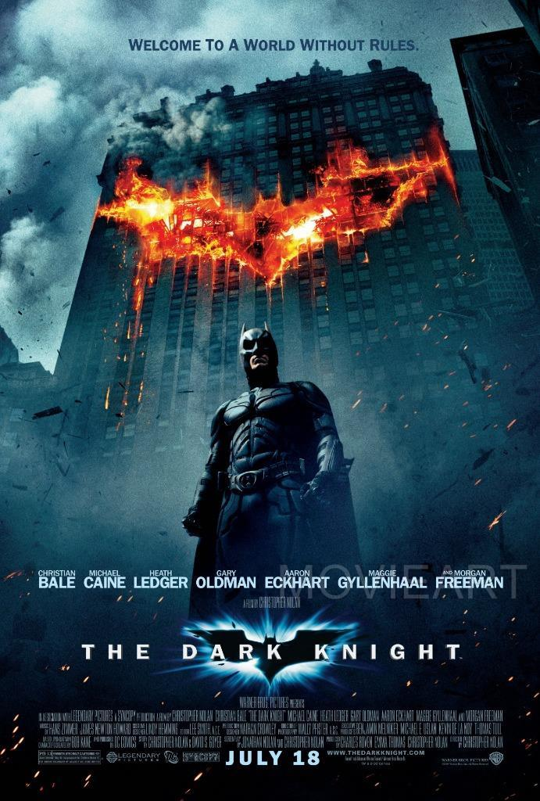

All of these films are highly regarded by [IMDB](https://www.imdb.com) however, does their typography in their titles, live up to the hype the film itself creates? Does its title typography resemble and exemplify its successful story? Or does it clash, not suit its style, and generate friction?

***1. The Shawshank Redemption*** 

[IMDB score – 9.2](https://www.imdb.com/chart/top/)

<iframe width="560" height="315" src="https://www.youtube.com/embed/S32h0-sthaI?rel=0" allow="accelerometer; autoplay; encrypted-media; gyroscope; picture-in-picture" allowfullscreen></iframe>

The font, designed by [Paul Hickson](https://fontmeme.com/the-shawshank-redemption-font/), illustrates the story of the environment that the characters live within. The design of the font reminds the audience of the lack of liberties that the main protagonists have due to its early civilisation style. The connection between the Wade Sans Light font, early civilisation and the environment of prison, tell a story of characters being stripped of any privileges. It Immediately tells the audience that this is a tough experience for the characters.

Its movie title has okay legibility, however its weighting on its characters are light. This means the words ‘The’ and ‘Redemption’ are harder to read than the word ‘Shawshank’. This may have been done to show that the characters have the bare minimum as they are in prison. The title isn’t worthy of having heavy weight as the characters have very little diversity of activities they can complete in the environment they’re in.

There’s little friction as the quality of the title is consistent and it’s coherent. Its light grey colour suitably matches with the film’s environment, representing the grey landscape of prison, although the lighter tone sends a message of hope to the audience. The typography uses monospace, in particular the word ‘redemption’, this may be to exaggerate the fact that these characters will follow a journey of redemption.

My typography score – 7.7

***2. The Godfather*** 

[IMDB score - 9.1](https://www.imdb.com/chart/top/)

<iframe width="560" height="315" src="https://www.youtube.com/embed/c5M6L6L_ksU?rel=0" allow="accelerometer; autoplay; encrypted-media; gyroscope; picture-in-picture" allowfullscreen></iframe>

In comparison to *[The Shawshank Redemption](https://en.wikipedia.org/wiki/The_Shawshank_Redemption)*, *[The Godfathers](https://www.imdb.com/title/tt0068646/)* typography has more to analyse. The audience will have a much different experience, not of sympathy for the plot but fear instead. This is down to the font being clearly in your face with its bold lettering, providing good legibility.

Its coherence is also good, the red font and outline of a puppeteer’s hand and string send a powerful message to the audience that whoever the Godfather is, they have power, control and a lot of blood on their hands. The heavy font shows the Godfathers role is important, he has a large amount of respect and that himself and others around him will spill blood if they have to.

This typography suits the film well, providing uncertainty for anyone about to watch it. Its quality overall is brilliant, its order is smoothly connected, reducing friction, showing the mob that the Godfather runs is organised, especially as the lettering’s width is condensed, potentially showing the people around him are tight to him at all times.

My typography score - 9.8

***3. The Dark Knight*** 

[IMDB score - 9.0](https://www.imdb.com/chart/top/)

[The Dark Knight](https://en.wikipedia.org/wiki/The_Dark_Knight_(film)) is the hardest to analyse due to its simplicity. The typography itself is clearly trying to portray the message that Batman in the film is serious and dependable. The typography is balanced throughout, its contrast, width, baseline and cap height of its strong, blockish font, represent this.

On[ Print's](https://www.printmag.com/post/typography-movie-poster-design) website they elaborate on my point, *Rafael Van Winkel,* the writer of the blog, says *'Superhero movie posters feature bold, thick typefaces that reflect the heroes’ strength. - Posters for classic well-known heroes such as Superman and Batman tend to stay away from this rule and go for something more simplistic and elegant.'*

What you get from the commercial based Franklin Gothic Demi typography is simple and easy to read. This is however the opposite of Batman who is far from simple and easy to read, meaning there’s friction between the main protagonist and the typography. A compliment I do have for the typography is the monospaced and separated lettering, it represents Batman as an independent superhero who works alone, taking responsibility of the crime within Gotham City.

Typography score – 7.4

The top three films of all time have spectacular plots and cinematography however their typography doesn’t necessarily live up to the high standards that they set for themselves. In most cases, they tell a part of the story and follow their genres typographic styles, enticing an audience to watch their films. My personal favourite is The Godfather out of this list.