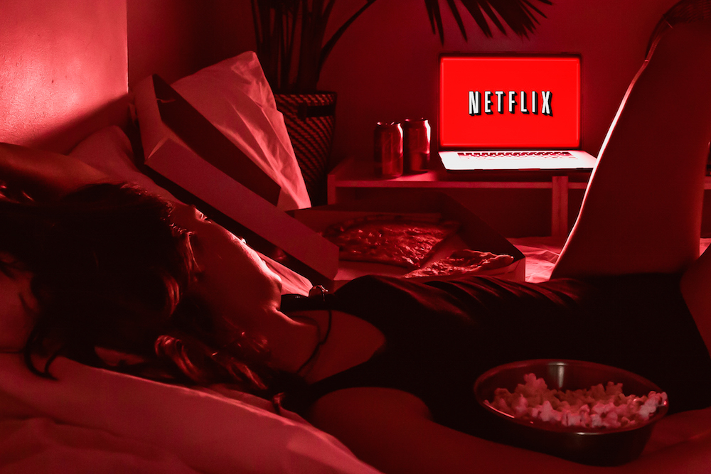

Since 2012, Netflix has disrupted cinema and television more and more over time, but has it disrupted the way we look at typography? Has typography been changed forever by Netflix’s existence or has it simply taken advantage of its properties and styles?

***Picking the film based on the font? Surely not?!***

Netflix’s font styles help express the feeling to a [Netflix original film](https://en.wikipedia.org/wiki/Lists_of_Netflix_original_films). They use a variety of different styles of fonts to express what sort of theme and genre they are trying to promote and what mood and atmosphere they would like to convey. The different styles of fonts range from decorative fonts to modern fonts, to achieve different themes such as fun and quirky to efficient and forward-thinking.

This is massively important to the Netflix interface and for all of the films on Netflix, as it helps direct its demographic of consumers to find the right show for them when browsing. Fonts are one of the most important items on Netflix’s interface, making it clear what genre it is, what themes it will have and if that suits you as a consumer.

This is very accessible to everyone, due to its tendency to use bold construction of headline fonts, making it easy to read and subtly grabbing your attention at the same time. The Netflix logo is a great example of easy accessibility for its audience, its logo/font is easy to read, selling Netflix as a company where you can relax and find something to watch with little effort. The curve in the logo is slouched almost like a hammock, signifying relaxation.

Netflix are selling an emotion and a story, evoking the emotion of relaxation amongst its consumers and potential future customers that Netflix is a place where you can relax and keep life simple. In fact, Netflix even have their own custom website design font: Netflix Sans.

***White? It's on your side.***

A theme I noticed that ran throughout Netflix Original films was its colour choice for its typography. It uses the very neutral colour of white in 34 out of 40 of its original films that it promotes on its home interface. This it to make it stand out in comparison to its usually expressive illustrations and photo backdrops to present the film to its audience.

The use of the colour white also doesn’t deter any untapped audiences from watching their programmes as nobody can dislike or like the colour white due to its importance in being the base of all other colours. On the other hand, Netflix does use a variety of different font styles to differentiate between what sort of film it is, whether that be a drama or a playful film.

***I'm only here for the font.***

The legibility of Netflix’s font is consistently the same, people know its Netflix and are comfortable and familiar with it. It keeps on attracting people, especially those who like familiarity. Those who are comfortable with a simple white and bold piece of typography to tell them which film they want to access. The legibility is also very clear and has quality, reaching its film audience easier due to its bold and white fonts. 

This makes it quite easy to understand however, Netflix doesn’t compromise creativity completely, they change the style of font based on the style of the film which is very evident to see. Netflix have clearly tapped into a certain form of comfort typography that has clearly worked to increase its audience. It has taken advantage of its styles and simplicity to generate more of an audience, inviting more and more people from its neutrality of design.