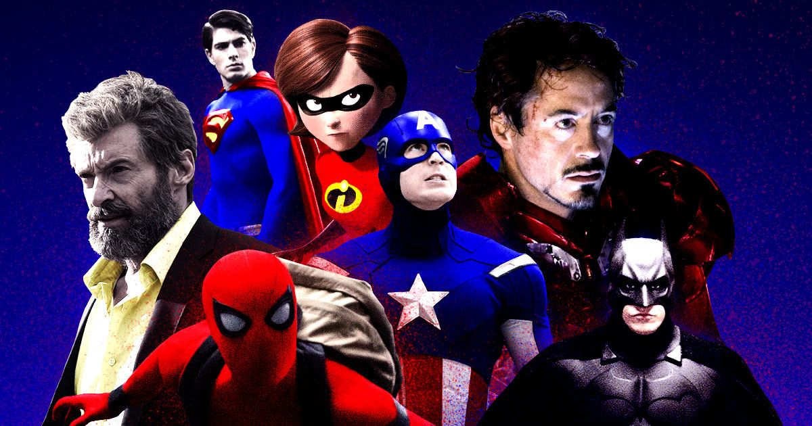
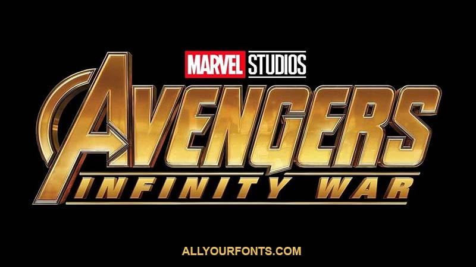
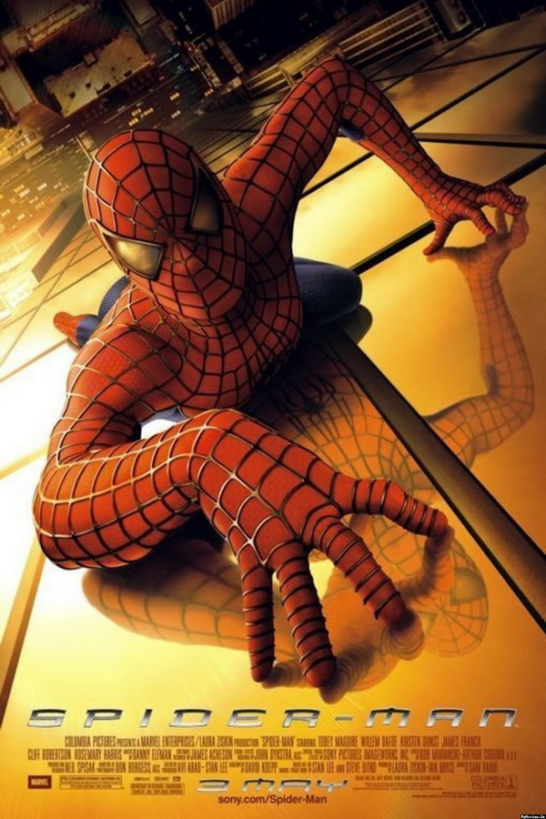
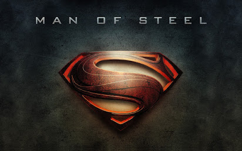

Superhero films consistently follow the same plot of good defeating evil, does its typography follow a similar linear route? Are superhero film fonts predictable, just like their plots?

***Working formula?*** 

There is always a debate over whether to stick with what works or to experiment and speculate if it works. Between creatives and marketing this is a particular issue and with superhero film typography even more so. Although, it may seem boring to be common in the real world, superhero film typography seems to oppose this frequent ideology, of standing out from the crowd. For example, for a superhero film typography you wouldn’t expect it to be a plump and rounded font, as this signifies a less serious tone for the film. You would usually expect the font to be sharp and jagged to show action and movement, making the superhero look serious and respected to the audience.

***It's a Bird, It's a Plane, It's a Superhero Film font!***

For a superhero film to be successful, people need to recognise it. If it doesn’t look like a superhero film, they will not view the film the same, even with familiar superheroes the audience may subtly not want to watch the film, due to an unfamiliarity of the font to the genre. Not only does it need to match its genre, it also needs to match its character well, superhero movie fonts have bold features and thick typefaces, reflecting the hero’s strength. 

The legibility is good as they have made it easy to read and attractive to their audience. The designers create the title based off the superhero’s abilities, if they are a slimmer, more agile superhero, such as [Spider-Man](https://en.wikipedia.org/wiki/Spider-Man), then the font will follow suit. This gives the audience a general idea of who the character is as a person and gives an idea of the theme. 

You may be thinking, well, surely this doesn’t only resonate with the genre of action and superhero films, surely it works for romantic comedies, for example? Superhero films are distinctively similar but different at the same time, they are usually repetitive in their design trends but expressive also. Following the design trends, it is clear that you are more likely to be successful with your target audience instead of going rogue with your design choices. It’s best to choose fonts that are headline fonts, designed to grab your attention with their boldness and flare for dramatic effect. 

An obvious company that achieves the right balance is [Marvel studios](https://www.marvel.com), who are one of the idols of superhero films. They make their fonts attractive and bold to look at, broadening their horizons of audiences by making it easy to understand what the superhero characters are based around. They are well made, none of them are a mismatch. 

More classic and well-known heroes such as [Superman](https://en.wikipedia.org/wiki/Superman) and [Batman](https://en.wikipedia.org/wiki/Batman) will usually require less expression in their fonts due to the familiarity of the two in popular culture. The typographic designers usually go for more simplistic and elegant styles, emphasising the importance of the superheroes and the respect they have from their audience.