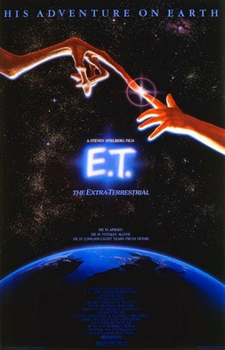

Science fiction films truly are based on the depths of our imaginations, they predict the future of the human race, some predictions have been right, some haven’t. How has science fiction fonts, changed as technology has advanced? What did people think the future would look like based on the design of their film fonts? 

 ***Do science fiction fonts predict the future of technology or show us what we already have?***

Throughout the history of film, we have been able to see the bond between the art of filmmaking, graphic design and visual culture as a whole. With science fiction fonts, we have arguably been able to understand what the film is predicting the future of society could potentially look like. Its colour, typographic style, and composition illustrate this, giving it story and character to generate interest.  

Most font styles involved with science fiction are usually inspired by the predictions of what technology will be like when the film is set. This sets up the film perfectly as it tells its target audience exactly what type of film it is, generating the correct interest as it appeals to the audience who are lovers of the genre. It is easy to identify a science fiction font as the title usually has some form of sans-serif typeface, which is usually commonly associated with this particular genre due to its sharp and perfect edges. This signifies the lettering/coding of a computer, which is the basis of most technology. As well as sans-serif fonts, other fonts that are involved with the science fiction genre are metal-textured 3D typefaces. 

***1960, predictions of a cleaner future***

*2001: A Space Odyssey* gives us an example of 1960’s science fiction fonts. The designer uses the font Gill Sans, deciding to go for it due to its clean design. If this tells us what their thoughts of what the year 2001 would look like, it would be a cleaner world, built around perfection, simulated around computers and streamlined by technology. 

 ***1980, variety of design is expanding*** 

Two decades later we saw the release of *E.T*, a light-hearted film in comparison to its counterparts within the genre. E.T’s font takes an approach where they use a fluorescent outline instead of going for a scientific based font. It doesn’t follow the usual modern design of a science font, with their efficient lines and the impression of being forward thinking. It uses its fluorescent glow to send a message that a relationship with Aliens, will be a positive one. One that does follow the design trends for its genre is *Back To The Future*, it also follows a light-hearted tone but this does have efficient lines and does give an impression of a forward thinking font. The design of the font slanted backwards and forwards, tells the story and theme of the film.

Modern day fonts showing the future? Or the present? 

The last fonts are *Ex Machina* and *Gravity*, both released 2014 and 2013. Both films have very simplistic fonts, sending a message that the future will be simpler to live within, due to technology. Little effort has gone into the fonts, they are smooth, simple and efficient. The fonts work with the genre of film, the legibility is good with the genre. It generates the correct interest as the design is much slicker and advanced in its design than the previous exampled. 

They create little friction as with modern technology it is able to create a film title that has great coherence, quality and order, to match the film genre perfectly. This shows that although science fiction fonts may be able to create some sort of prediction, of what technology will be like. Its probably more likely that they are just design, based on existing technology, instead of a prediction.