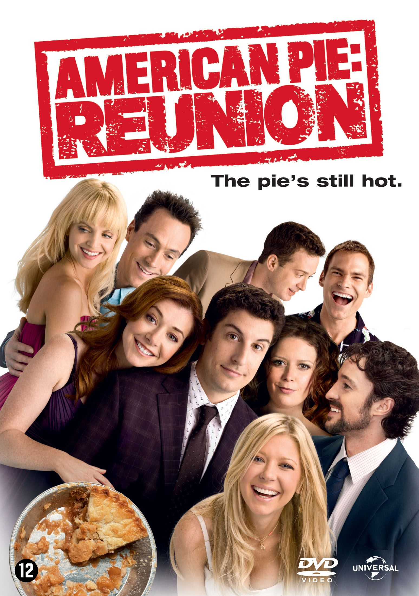
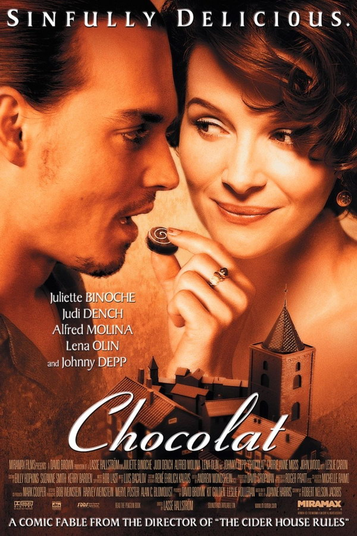

If some of the most successful films owned radically different fonts, they would not have been regrded as one of the most successful films. The entire story, character and emotion, are told through the fonts legibility to the genre. For a kid’s film to come across scary, based on its font, it would be a disaster for the promotion of the film for example.

***A delicate balancing act*** 

Throughout the design process, creators and designers try to use their skills, targeting the audience of the genre the film sits under. By achieving this, they will be able to make people understand what genre it is. Should they all try to achieve the same thing, there is a delicate balance between making people understand what story your film will follow and standing out from the many other films like yours.

There’s certainly an argument as to whether it’s a good idea to sacrifice creativity to make sure you are accessing your target audience or to take a risk, to expand your audience. To achieve both, you are probably likely to get a bonus. Typography is very emotionally sensitive to whoever is reading it, if you take your creativity too far, the story, emotion and character you are trying to convey may come across the wrong way.  

***Big, bold and definitely a comedy...***

Comedy is a great example of how this works. Comedy fonts usually come across as playful and light-hearted, due to their simple design. They use a big and bold design, pushing it towards your face, grabbing your attention. They use simplistic designs such as arial and Helvetica, showing that this comedy is just about ordinary people, nothing fancy.

This appeals to a lot more people as most people can relate to the story. The stories are usually in a normal environment and time.  The Helvetica and the simple background we commonly see in comedies, make it simple and easy to read, it creates little potential for friction and because of this it doesn’t lead the audience to believe the comedy is actually a part of one of the comedies sub-genres.

***That font is... scary.*** 

A genre which makes its typography choices even more valuable is horror. The styles of horror fonts are usually edged and rough to never make you feel like there is any form of comfort in the film. The fonts are designed to make you feel uneasy, they usually have a irregular layout of their font to make you feel like nothing is normal in this film, giving you a sense of fearing the unknown. 

***I LOVE YOU!!!!***

The last genre I will explore that expresses why it is good to follow genre trends is romance. The weight of the font is usually light to create more of a feminine feel to the film, unless it’s a romantic comedy. The fonts used are usually associated with romantic handwriting. If the font was sharp and jagged it wouldn't be welcoming and delicate, if it was bold and in your face it wouldn't feel like love, something which is usually associated with subtleness and care. 

Now, can you imagine breaking these trends for the genres? would you watch the films? Would you recognise the film? There is plenty of reasoning as to why typography trends exist, they are tried, tested and produce significant economic advantages, taking the risk of swaying from this, is too much of an economic risk for a production company.