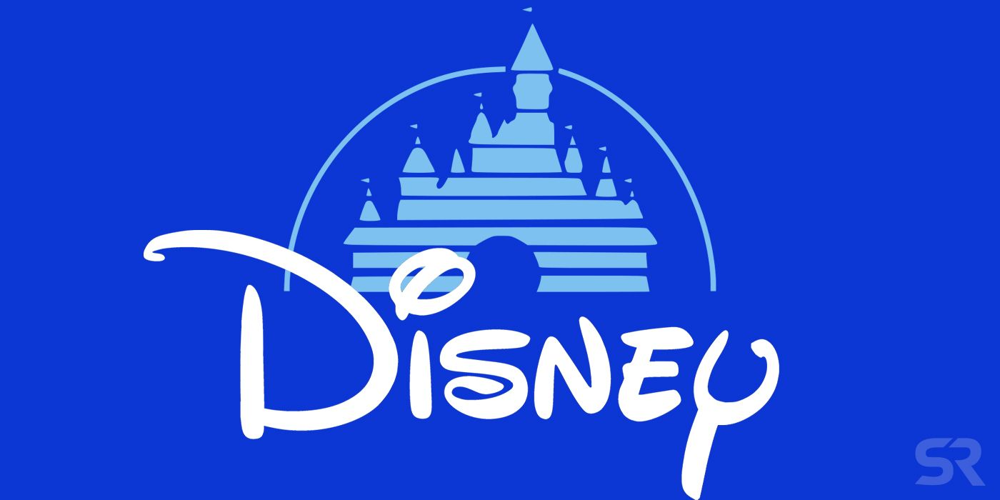
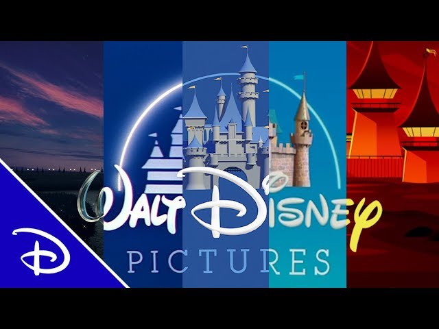

The typography from Disney films were the first film font designs I was ever exposed to, although I wouldn’t have thought about the design choices, the design choices would have thought about me. Although I wouldn’t have thought about it, my developing brain subconsciously would have done. 

***Mummm, can we go seeee finding nemoooo.***

Most Disney film fonts have a hand-drawn and cartoon feeling to them, providing a feeling of youthful mischief. They are usually decorative fonts, designed so they are quirky, creative and fun. These styles of fonts make a child feel like they are going to have fun before they have seen a second of the film. I remember as a child wanting to go see a film based off its colourful and animated film poster or advert. The shape of the letters and the associations children have of these from previous animated Disney films, makes them more attracted to Disney films.  

Disney film fonts are based not only on the genre (like most other films) but more on the story. Their stories are almost their own genre of animation. When you look at a Disney product and its typography, it screams to you that this is a Disney product. A good example is Cars, its typography is based off a real-life car font, probably suggesting that this film is a sports film, focusing particularly on motorsport. The colour, imagery and composition, change this perception however, promoting it as a Disney film more than anything. 

This point is reinforced by the Pirates of the Caribbean logo. The font that is used is blackletter. Usually associated with pirates anyway, this font immediately tells you what the film is about. Disney are excellent at telling you what the story and characters will be. Based off their fonts, colour and typography, they immediately set the tone of the film for its audiences. 

It’s not only their colours and typographic choices that help the audience understand what films they are promoting; it is also their imagery. Many of the classics that I watched when I was younger have subtle but obvious imagery, immediately reinforcing the title of the film and the story which is about to be told. Some Disney film titles are listed below;

* ***Bugs Life* (1998)** – They use bugs as a replacement for the holes in the lettering of B, U and G.
* ***Finding Nemo* (2003)** – In Finding Nemo, they replace the hole of the word O for a small fish, who is most likely the character of Nemo.
* ***Ratatouille* (2007)** – This film uses the main protagonist’s nose, whiskers and chef’s hat as the dot above the I. 
* ***Monsters University* (2013)** – Even though there isn’t an opportunity to fill a hole in the lettering with this one, they still incorporate an eye into the M.

  

Disney achieve two objectives with their typographic choices. The interest they create, makes the film they are trying to promote recognisable. They make their typography recognisable to the story they are trying to promote, while also making the font recognisable to the brand of Disney. The quality of Disney’s typographic design is unmatched. They achieve these two objectives, objectives which create large success for the films.