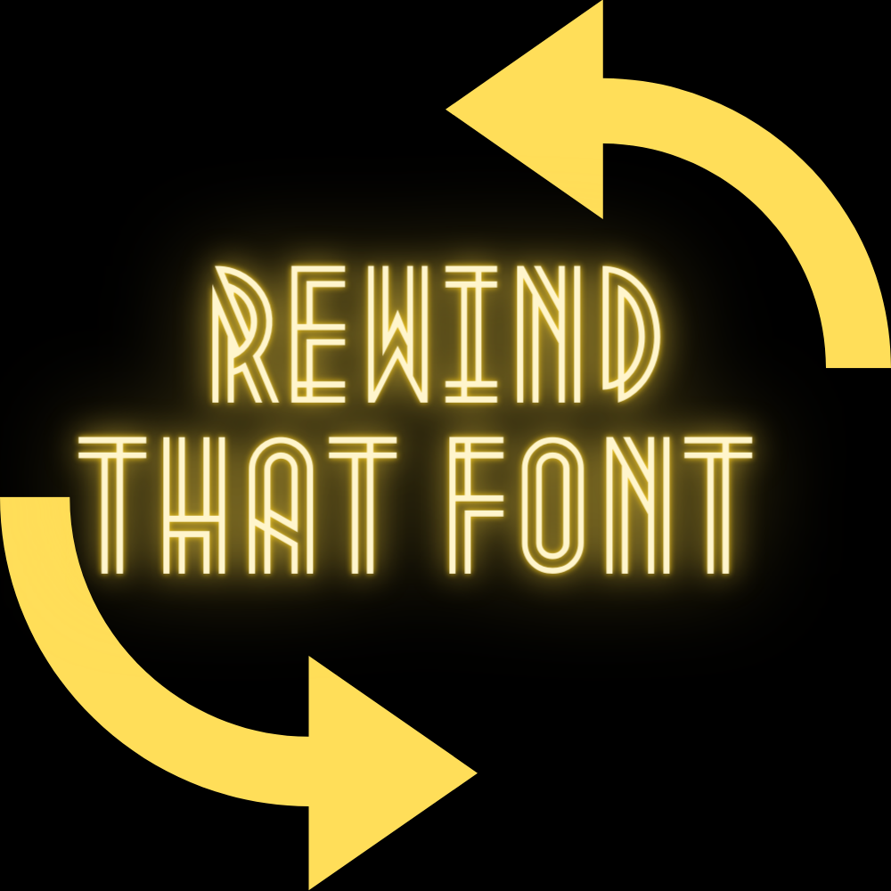

*Rewind That Font* is an online blog focusing its theme on film typography. With topics ranging from classic film titles to how *[Netflix](https://www.netflix.com/gb/)* has changed film typography. It focuses on the past and present, taking a look at the most unforgettable and iconic typography, throughout the history of film. *Rewind That Font* also takes a look at how typography in film is changing overtime.

My rationale behind the logo was to create a contrast between a black background and the bright colour of yellow, expressing the fact that Rewind That Font explores typography from a black and white era of film where it all began, to a modern era. The arrows pointing in both directions are to show that I will be taking a look back and forwards in time when studying film typography. 

The 1930's style of font, communicates a vintage tone in comparison to the blockish style of the arrows, they create a contrast of a modern style. This is to show that Rewind That Font explores modern film typography as well as historical and more traditional typography.

The font is a signifier of vintage cinema and the beginning of colour film. It is a sophisticated font to suit the sophisticated responses and analysis to the film typography that I will be writing about. I have made it easy to read and yellow, to express the importance of colour in studying film typography. I have also used yellow as a signifier to signify that Rewind That Font is like a lightbulb, a website publication full of ideas.

My reason for starting Exist was to improve my skills, focusing on my writing, designing, and communication, while working in a team, to create something respected and consistent. Applying what we learn from our course, I believe we can create something that we can all be proud of. Some facts about me are that I’ve always been more of a summer person, with the attraction of music festivals to going to the beach it’s hard for me not to be. Outside of my love for summer, I enjoy keeping active (especially at the moment) and my sport of choice has always been football, no contest. Other pastimes include relaxing on PlayStation, to going on a night out! Previous jobs have included working at Bombay Sapphire distillery, if you can’t tell, I love a drink. In my time there I worked on the bar, while saving money to go do what I always wanted to do, which is to travel. If you fancy putting your magnifying glass over the highlights of my life or would love to see what’s going on in my World, go ahead and follow my instagram.

Rationale

Illustrate the large version of the logo – explore why I used it etc

This page is where you write something about yourself. add pictures so that people know where you come from or where you live.

This file is an example of a page in Jekyll, that automatically shows up in the header navigation, you can delete or modify this file freely.

This file is saved inside the *pages* folder and is saved as *about.md* . Any file in this folder (as long as it has  the YAML header) will automatically show up as a link in the header bar.

You should use **markdown**to write this text and this will automatically be converted to `HTML`.